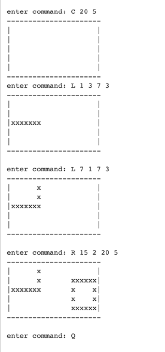

# CmdDraw
This a simple text (ASCII) based drawing program (something similar to a simplified version of Paint). 
The basic program allow users to:
1. Create a new canvas
2. Draw on the canvas using text based commands 
3. Quit the program

## Commands
| Example    | Description                                                                                                                                         |
|------------|-----------------------------------------------------------------------------------------------------------------------------------------------------|
| C w h      | Create a new canvas of width w and height h                                                                                                         |
| L x1 y1 x2 | Draw a new line from coordinates (x1, y1) to (x2, y2) horizontally or vertically. Lines are made up of the x characte y2 r                          |
| R x1 y1 x2 | Draw a new rectangle, with upper left corner at coordinate (x1, y1) and lower right coordinate at (x2, y2). Lines are y2 made up of the x character |
| Q          | Quit the program                                                                                                                                    |

## Examples
A sample run of the program is show below. The user input is prefixed with enter command:

